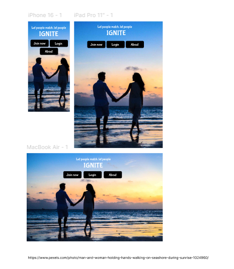

# The Love Sparks

## - GitHub Repo: https://github.com/enrightc/lovesparks

## - Deployed at: https://enrightc.github.io/lovesparks/

# Table of Contents

1. [GitHub Repository & Deployment](#github-repository--deployment)
2. [Overview](#overview)
3. [AIM](#aim)
4. [How It Works](#how-it-works)
   - [Step 1: Personalized Questionnaire](#step-1-personalized-questionnaire)
   - [Step 2: Finding a Match](#step-2-finding-a-match)
   - [Step 3: Connection](#step-3-connection)
5. [Time Commitment, Skills Gap & Team Effort](#time-commitment-skills-gap--team-effort)
6. [Pivot & Final Implementation](#pivot--final-implementation)
7. [What We Built](#what-we-built)
   - [Home Page](#home-page)
   - [Profile Page](#profile-page)
   - [Find a Match Page](#find-a-match-page)
   - [Login Page](#login-page)
   - [Register Page](#register-page)
8. [Lessons Learned](#lessons-learned)
9. [Future Plans](#future-plans)
10. [User Stories](#user-stories)
    - [First Time Users](#first-time-users)
      - [Landing Page](#landing-page)
      - [Registration Form](#registration-form)
      - [Email Registration / Verification](#email-registration--verification)
    - [Returning Users](#returning-users)
      - [Login Form](#login-form)
      - [Navigation](#navigation)
      - [Match Page](#match-page)
      - [User Dashboard / Profile Settings](#user-dashboard--profile-settings)
      - [Security Settings](#security-settings)
      - [Filter for Potential Matches](#filter-for-potential-matches)
      - [Match Alert](#match-alert)
      - [Profile Details](#profile-details)
      - [Chat Page (Active Matches Section)](#chat-page-active-matches-section)
      - [Report / Block](#report--block)
    - [Admin Users / Mods](#admin-users--mods)
      - [Admin Dashboard](#admin-dashboard)
      - [Show Profile Details](#show-profile-details)
      - [Moderation & Enforcement](#moderation--enforcement)
11. [Feature Enhancements](#feature-enhancements)
    - [Backend Integration](#backend-integration)
    - [Enhanced Chat Features](#enhanced-chat-features)
    - [AI-Powered Matching](#ai-powered-matching)
    - [Safety & Moderation](#safety--moderation)
    - [Community & Support](#community--support)
    - [Business & Monetization](#business--monetization)
12. [To Run the App](#to-run-the-app)
13. [Wireframes](#wireframes)
    - [Homepage](#homepage)
    - [Login Page](#login-page)
    - [Game Page](#game-page)
14. [Technologies](#technologies)
    - [Languages](#languages)
    - [Development Tools](#development-tools)
    - [Methodologies](#methodologies)
    - [Frontend Frameworks and Libraries](#frontend-frameworks-and-libraries)
15. [Bugs](#bugs)
    - [Testing with Lighthouse](#testing-with-lighthouse)
    - [HTML W3C Validator Testing](#html-w3c-validator-testing)
    - [Solved Bugs](#solved-bugs)
    - [Unsolved Bugs](#unsolved-bugs)
16. [Future Improvements](#future-improvements)
17. [Meet the Team](#meet-the-team)
18. [Final Word](#final-word)

## 

**** is a dating app designed for users who value personality over superficial swiping. Instead of seeing a full profile immediately, users discover potential matches through a step-by-step reveal of key personality traits, ensuring compatibility is built on genuine interest.

## 

- To revolutionise online dating by prioritising meaningful connections over superficial swiping.
- By using progressive personality/like matching system the app encourages users to engage with potential partners based on compatibility rather than appearance alone.

### 📝 Step 1: Personalized Questionnaire

First up, users fill out a **quick questionnaire** to highlight their personality traits and preferences. No endless forms—just enough to get a solid idea of what makes them tick.

### 💡 Step 2: Finding a Match

- Matches are shown **one at a time**—no overwhelming lists or endless swiping.
- Instead of seeing a full profile straight away, users get a **single personality trait** (e.g., **Adventurous, Introverted**), represented by a simple image.
- If they **like** what they see, they move on to the **next trait** of that match.
- If they **don’t**, they move on to someone else—no harm, no foul.
- To reveal a full match, users need to **approve three traits in a row**.
- If they like all three, boom—the match is **revealed**, and they finally see the person behind the traits.
- If at any point they’re not feeling it, they skip to a new match and start fresh.

### 💬 Step 3: Connection

- Once a match is revealed, users can **choose to start a conversation**—no pressure, just an option.
- If they’re not interested, they simply move on and start the process again.

The whole idea is to **put personality first** and make connections that actually mean something. No snap judgments—just a bit of curiosity and a fun way to discover people who genuinely click.

## ⏳ Time Commitment, Skills Gap & Team Effort

Hackathons typically suggest a commitment of **3–5 hours per day**, but for our team, this proved to be a challenge. Many members were only able to contribute **a few hours throughout the entire event**, in some cases **as little as 5 hours in total**.

This created a **significant gap** that had to be picked up by a core group of **four dedicated team members**, each putting in **12+ hours per day** to ensure our project came together. Alongside the time commitment, this also meant overcoming a **major skills gap**, requiring us to **learn on the fly, support each other, and step outside our comfort zones** to keep things moving.

Despite these challenges, we **pulled together as a team**, adapted where necessary, and made the best of the time and resources we had. It was a true demonstration of **resilience, problem-solving, and teamwork**, and we’re incredibly proud of what we achieved! 🚀🔥

We originally planned to build this as a full-stack application using Django for the backend. However, due to time constraints and challenges with implementation, we decided to pivot and focus on a front-end prototype to effectively demonstrate our concept.

Rather than give up, we wanted to create something to showcase —we owed it to ourselves to bring our vision to life. We had a **fantastic idea that needed to be shared**, and this prototype allows us to present it in a way that highlights its potential.

Even this pivot was **a challenge in itself**, requiring all of us to **pull together, adapt, and contribute** to make it happen. Everyone played their part, stepping up to ensure we had something solid to present. It’s been a true team effort, and we’re proud of what we’ve achieved! 💪🚀

Instead of a fully functional application, we have created an interactive **HTML, CSS, and JavaScript prototype** that simulates the intended user experience. This includes:

- **Home Page** – Overview of the platform
- **Profile Page** – Displays user details and simulated matches
- **Find a Match Page** – Simulates searching for potential matches
- **Login Page** – UI for user authentication
- **Register Page** – Form to collect user details for profile display

While there is no backend or database, **JavaScript** is used to create a dynamic experience that showcases the intended user journey. This allows us to effectively present our vision despite the technical constraints.

- **Rapid prototyping** and adaptability are crucial in hackathon environments
- **Breaking down features** into smaller, manageable components helps maintain momentum
- **A front-end simulation** can still effectively communicate an idea without a full backend implementation

If we had more time, we would:

- Implement **Django** for user authentication and data storage
- Fully integrate **matchmaking logic** with a backend database
- Enhance **interactivity** with real-time updates

We’re proud of what we’ve achieved in the time we had and excited to share our work! 🎉

## 

### 

### Landing page

- As a first time user: I want to have an overview of what the date app offers (easily grasp the concept of the app) and be able to sign in to get matched.
  - Acceptance Criteria:
    - Landing page with a clear overview for first time users.
    - Button to sign in (link to registration form).
    - About link.

### Registration Form

- As a first time user, I want to easily register and create a profile (account) so that I can start searching for matches.
  - Acceptance Criteria:
    - Registration Form.
    - Inputs to write my Personal Details.
    - First Name, Last Name, Alias, Location, Birthdate, Email, Password (password confirmation).
    - Checkboxes / Select inputs to select my preferences.
    - Simple quiz to establish personality/likes/hobbies (three questions?).
    - Questions with checkbox to select answers.

### Email registration / verification

- As a first time user, I want to verify my email so that I can ensure my account is secure.
  - Acceptance Criteria:
    - Send email with link to verify or authenticate account.
    - After clicking link in email you get access to your new match app profile and matches.

* Acceptance Criteria:
  - Registration Form
  - Inputs to write my Personal Details
  - First Name, Last Name, Alias, Location, Birthdate, Email, Password (password confirmation)
  - Checkboxes / Select inputs to select my preferences
  - Simple quiz to establish personality/likes/hobbies (three questions?)
  - Questions with checkbox to select answers

### Email registration / verification

- As a first time user, I want to verify my email so that I can ensure my account is secure
  - Acceptance Criteria:
    - Send email with link to verify or authenticate account.
    - After clicking link in email you get access to your new match app profile and matches

### 

### 🔑 Login Form

- As a registered user, I want to easily sign in.
  - **Acceptance Criteria:**
    - Sign-in form to log in.

### 🧭 Navigation

- As a registered user, I want to have **easy access to navigate** the app.
  - **Acceptance Criteria:**
    - Navigation menu with links to:
      - Profile dashboard / settings
      - Chats
      - Log out

### 💘 Match Page

- As a registered user, I want to **easily find potential matches, continue as long as needed, and connect with people who share similar interests** so that I can build meaningful relationships.
  - **Acceptance Criteria:**
    - **Step-by-step reveal process:**
      - Random display of a single potential match with **4 hidden categories**.
      - Categories are revealed **one at a time** upon user interaction (with captions?).
      - Final reveal shows the **profile picture and summary** (alias or first name, location, short bio).
    - **Decision phase:**
      - After the profile pic is revealed, users can choose to:
        - **“Ignite”** – Accept the match and start a chat.
        - **“Next”** – Skip and move to another potential match.

### 🔧 User Dashboard / Profile Settings

- As a registered user, I want to **update my profile and preferences** if needed so that my information stays accurate and relevant.
  - **Acceptance Criteria:**
    - **Edit Profile Form**
    - **Edit Preferences Form**
    - **Manage privacy settings** to control who can see my profile.

### 🔒 Security Settings

- As a registered user, I want to **control my privacy settings** so that I can decide who can see my profile.
  - **Acceptance Criteria:**
    - Security settings to adjust **profile visibility**.
    - Profile display based on **chosen privacy levels**.

### 🎯 Filter for Potential Matches

- As a registered user, I want to **filter my matches based on my preferences** so that I can find suitable partners.
  - **Acceptance Criteria:**
    - Advanced filter system (e.g., filter matches by **age range**).

### 🔔 Match Alert

- As a registered user, I want to **be notified when I’ve been matched**.
  - **Acceptance Criteria:**
    - Display match notification with options to:
      - **Accept** – Starts a new SparkChat.
      - **Pass** – Returns to the Match Page.

### 👤 Profile Details

- As a registered user, I want to **view my match’s profile** so I can get a better idea of the person and reference it later.
  - **Acceptance Criteria:**
    - Profile display component (page or modal) showing:
      - Profile pic, alias, location, interests, hobbies, values, and revealed personality traits.

### 💬 Chat Page (Active Matches Section)

- As a registered user, I want to **send and receive messages securely** so that I can communicate with my matches and keep track of conversations.
  - **Acceptance Criteria:**
    - Sidebar/dropdown to show **all active chats**.
    - **Chat interface** with:
      - Ability to send and receive messages.
      - Display of **message history** with timestamps.
      - Distinction between **my messages** and **match’s messages**.
      - **Text input with send button**.
      - **Report user button**.
    - **View Profile button** (links to profile or opens a modal).
    - **Report or Block button**.

### 🚫 Report / Block

- As a registered user, I want to be able to **report or block disrespectful users**.
  - **Acceptance Criteria:**
    - **Report button** accessible in various parts of the app (chat, match page, etc.).
    - **Block button** available in chats and profile views.

---

### 

### 🛠️ Admin Dashboard

- As an admin, I want to **oversee user activity** to maintain a **safe and respectful environment**.
  - **Acceptance Criteria:**
    - User management panel displaying:
      - **Active, inactive, and banned users**.
      - **Reports submitted by users**.
      - **Existing matches** (optional, for investigation).

### 🔍 Show Profile Details

- As an admin, I want to **access and manage user profiles**.
  - **Acceptance Criteria:**
    - Display **user profile details**, including:
      - Profile picture, alias, location, and other relevant info.
      - Related **matches** (optional).
      - Any **reports** filed against the user.
      - **Suspend / Ban button**.

### 🚨 Moderation & Enforcement

- As an admin, I want to **take appropriate action against users who violate community rules**.
  - **Acceptance Criteria:**
    - **Warning button** – Sends a **first warning** for minor issues.
    - **Suspend button** – Temporarily suspends an account after repeated warnings.
    - **Ban account button** – Permanently removes a user for repeated or severe violations.
    - **Delete user button** – Removes an account from the system.
    - **Automated ban or suspension?** (TBD)

- Log in using your github account,
  - https://github.com/enrightc/lovesparks.git
- Fork your own copy of the respository (on the righthandside of the page)
- click the down arrow and then + "Create a new fork"
- Now you have your own copy of the APP
- On the righthandside is a big blue button with " <> Code click on here to get a HHTPS which you can run in vs-code.

- To run a frontend (HTML, CSS, Javascript only) application in the terminal, type:

  `python3 -m http.server`

  ## - GitHub Repo: https://github.com/enrightc/lovesparks

  ## - Deployed at: https://enrightc.github.io/lovesparks/

## 

## Wireframes

### 🏠 Homepage

### 🔑 Login Page

### 👤 Game Page

## 

### Languages:

Languages:

### Development Tools:

### Methodologies:

### Frontend Frameworks and Libraries:

Design and Visuals:

## Bugs 

### Testing with Lighthouse

#### Homepage

#### Registration Page

#### Login page

#### About page

#### Matches page

#### Chat page

#### Profile page

## HTML and CSS W3C Validator Testing

| Page | date | Comments | Pass/Fail |
| --- | --- | --- | --- |
| index | 17/02/2025 | Stray header tag removed as well as trailing slashes. Moved footer inside body and removed unused div closing tag  | Pass |
| Login | 17/02/2025 | Amended anchor element being a descendant of the button element and changed h1 to h2 element | pass |
| Registration | 17/02/2025 | Removed all the <b> tags from inside the <option> tags | Pass |
| Error 404 | 17/02/2025 | Removed unused div element | Pass |
| About | 17/02/2025 | Fixed empty headings inside the cards. Closed unclosed div tags. | Pass with warning |

### Solved Bugs 

### Unsolved Bugs 

## Future Improvements 

### 🚀 Feature Enhancements

Backend Integration

- Implement Django (or Node.js/Express) for user authentication and data storage.
- Use PostgreSQL or NeoDB to store user data and match interactions.
- Add real-time notifications for matches and messages.

Enhanced Chat Features

- Implement end-to-end encryption for chat messages.
- Add voice messages & video calling options for deeper connections.
- Integrate GIFs & emojis for a more engaging chat experience.

AI-Powered Matching

- Implement AI/ML algorithms to improve match suggestions based on user interactions.
- Use sentiment analysis in messages to suggest conversation starters.
- Personalize match recommendations by learning from user preferences.

🔐 Safety & Moderation

Advanced Security Measures

- Add two-factor authentication (2FA) for account security.
- Use AI moderation tools to detect inappropriate messages.
- Implement user verification badges to prevent catfishing.

Community & Support

- Add user-generated content like dating tips & success stories.
- Introduce anonymized feedback surveys to improve matchmaking.
- Implement live chat support for quick help.

📈 Business & Monetization

Premium Features (Freemium Model)

- Introduce Love Sparks Plus with exclusive features like:
- See who liked your profile.
- Unlimited chat & swipes.
- Advanced match filters.

Local Events & Matchmaking

- Host virtual speed dating events in-app.
- Provide local meetup suggestions based on mutual interests.

## 

## 🔥 !Final Word

Hackathons are an incredible way to connect with the coding community, learn from one another, and step away from the often overwhelming world of online learning. Throughout this journey, we faced our challenges head-on, adapted, and stayed committed to our vision.

What truly set us apart was our teamwork—embracing agile learning, problem-solving together, and communicating effectively. Every team member played a crucial role, bringing leadership, creativity, and motivation to the table. The energy and determination were inspiring, making this experience not just about coding, but about collaboration, resilience, and innovation.

A huge thank you to our team and the support from CI—your guidance and encouragement made this possible.

We hope you enjoy "Ignite", our dating app that challenges the superficial nature of modern dating. In a digital era that often prioritises appearances, we believe it's time to return to the essence of true connection—understanding what a user truly wants and needs.

💖 Enjoy the experience, spark meaningful connections, and let love ignite!
